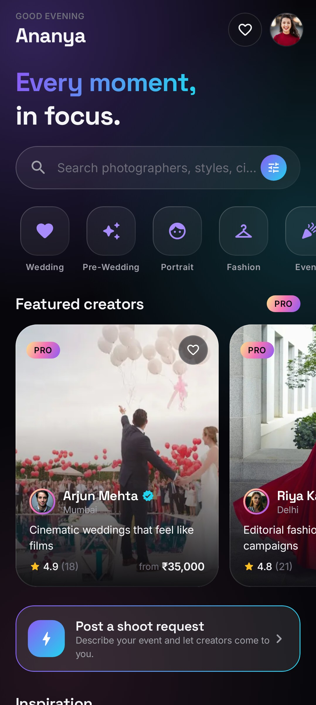
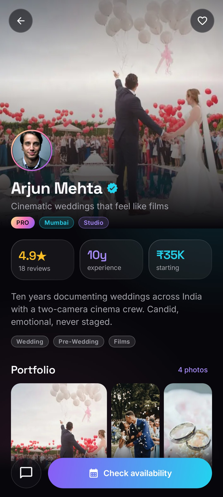
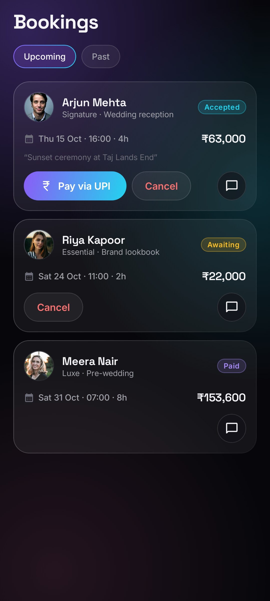
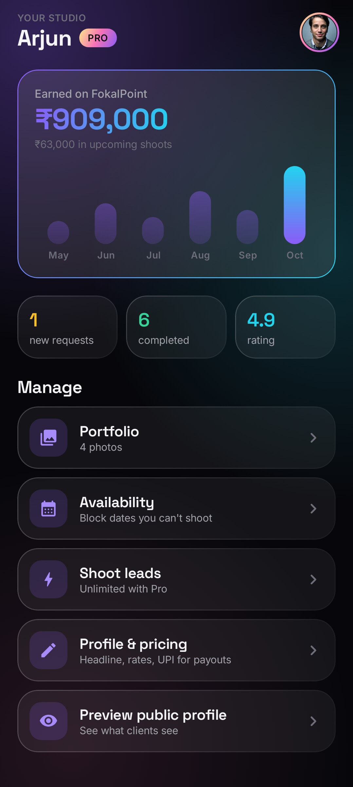
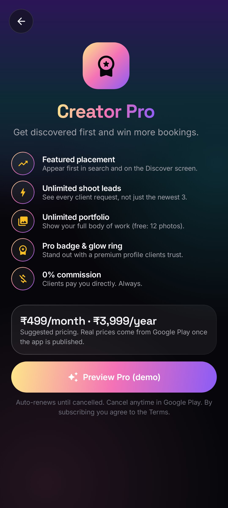

# FokalPoint

> **Every moment, in focus.** Book photographers and filmmakers — or get booked.

A premium Android marketplace (Kotlin + Jetpack Compose, "Aurora Noir" design) connecting clients with
photographers and videographers, backed by Supabase. Monetized with a **Creator Pro** subscription
through Google Play Billing.

| Discover | Creator profile | Bookings | Creator Studio | Creator Pro |
|---|---|---|---|---|
|  |  |  |  |  |

## Features

**Clients** — discover featured & top-rated creators, filter by style / city / budget, view portfolios,
packages (Essential / Signature / Luxe), reviews and live availability; request a booking; pay the
creator directly via any UPI app once accepted; chat; review after the shoot; save favourites; post a
shoot request for creators to answer.

**Creators** — Studio dashboard (earnings chart, requests, rating), accept/decline/complete bookings,
confirm payments, availability calendar, portfolio uploads, shoot leads, profile & pricing editor,
private UPI ID shown only to accepted clients.

**Creator Pro** (Play subscription `creator_pro`) — featured placement, unlimited leads (free: 3),
unlimited portfolio (free: 12 photos), Pro badge. All perks are enforced by the database, and
purchases are verified server-side with the Google Play Developer API.

**Platform** — email/password + 6-digit email code, Google & GitHub sign-in, password reset,
in-app account deletion, background notifications for new requests and messages, offline demo mode.

## Run it

```bash
cp .env.example .env          # optional: add Supabase keys; placeholders = demo mode
./gradlew assembleDebug       # app/build/outputs/apk/debug/
./gradlew testDebugUnitTest   # unit, UI flow and (optional) live-backend tests
./gradlew recordRoborazziDebug --tests com.fokalpoint.app.StoreScreenshots   # re-render store/screenshots
```

**Demo mode** (no Supabase keys): any email/password works and a sample marketplace with bundled photos
is preloaded — great for trying every flow offline. **Live mode**: set `SUPABASE_URL` /
`SUPABASE_ANON_KEY`.

## Publish

See **[store/PLAY_STORE.md](store/PLAY_STORE.md)** — backend deploy commands, signing, Play Console
subscription setup, listing copy, data-safety answers, graphics and a launch checklist.
Release bundles are built by `.github/workflows/release.yml`.

## Architecture

- `ui/theme`, `ui/components` — Aurora Noir design system (Space Grotesk + Inter, glass surfaces)
- `ui/screens`, `ui/navigation` — Compose screens and navigation
- `ui/viewmodel` — `AuthViewModel` (sessions), `FokalViewModel` (marketplace), `ProViewModel` (billing)
- `data/supabase` — GoTrue auth, PostgREST/Storage/Functions client, mappers
- `data/billing` — Google Play Billing; `data/sync` — background notifications
- Room is the on-device cache; Supabase is the source of truth in live mode
- `supabase/migrations` — schema, RLS and guard triggers; `supabase/functions` — Pro verification, account deletion

`LiveBackendIntegrationTest` runs the real app code against a Supabase-compatible backend when
`FOKAL_LIVE_URL` / `FOKAL_LIVE_KEY` are set (skipped otherwise).
